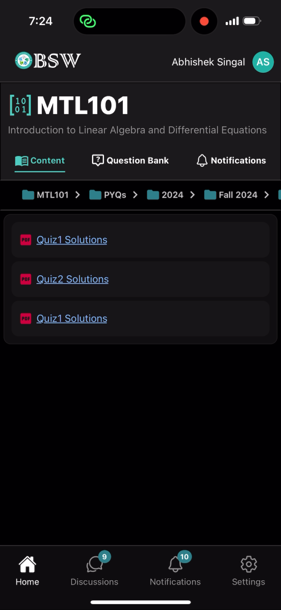
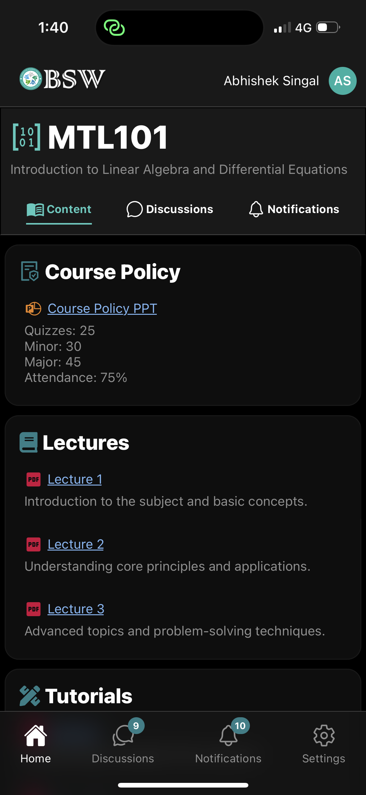
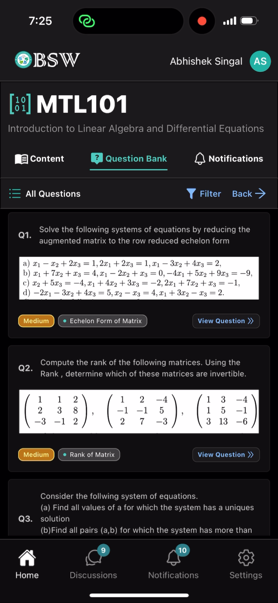
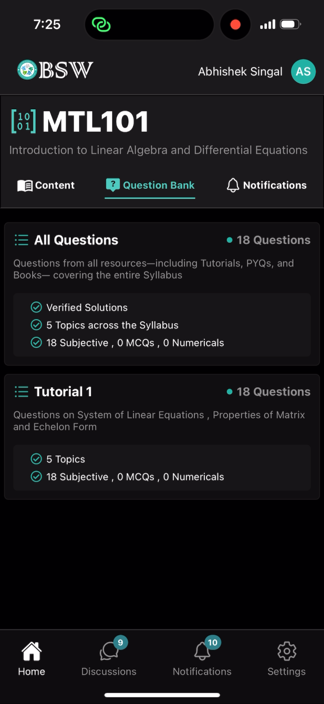
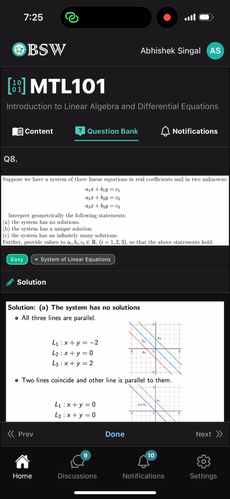

# BSWApp

**BSW Student Application** — A collaborative platform for IIT Delhi students to access academic resources, participate in discussions, and ask or answer questions. Built with a modern **React Native frontend** and a **Node.js + Prisma + PostgreSQL backend**, this app is currently **under development** to provide a seamless and engaging learning experience.

---

## Tech Stack
- **Frontend:** React Native
- **Backend:** Node.js, Prisma
- **Database:** PostgreSQL

---

## Features
- Access academic resources
- Ask and answer questions
- Participate in student discussions
- Modular and scalable architecture

---

## Screenshots

### Course Browser

### Course Content

### Question Bank

### Question Sets

### Question Viewer

---

## Status
- Backend: Completed ✅  
- Frontend: Added, actively under development

---

## Contribution
This project is developed by the **BSW IIT Delhi Technical Team**. Contributions focus mainly on frontend UI/UX and backend integration.  

